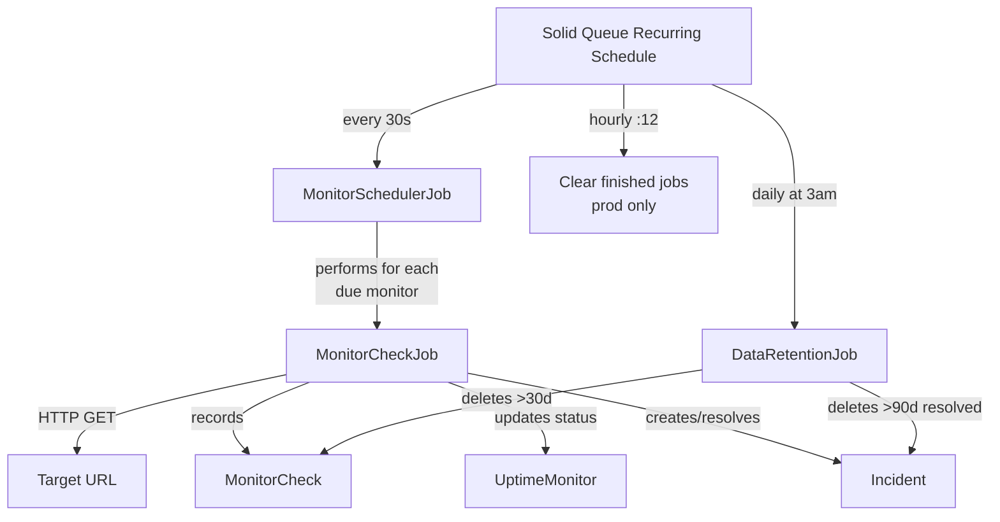

# UpTimer

Uptime monitoring dashboard for tracking service health, response times, and incidents.

## Prerequisites

- Ruby 4.0.5 (see `.ruby-version`)
- SQLite3
- [RVM](https://rvm.io) (recommended for Ruby version management)

## Setup

```bash
# Clone and enter project
git clone https://github.com/binilsn/up-timer.git
cd up-timer

# Activate Ruby (RVM users)
rvm use

# Install dependencies
bundle install

# Setup database
rails db:create
rails db:migrate

# Start development server
bin/dev
```

`bin/dev` starts:
- **Web server** (Puma) on `http://localhost:3000`
- **CSS watcher** (Tailwind CSS v4)
- **Job worker** (SolidQueue) for background jobs

## Auth

Authentication is handled by Rodauth. Default routes:

| Route | Description |
|---|---|
| `/login` | Sign in |
| `/create-account` | Register new user |
| `/logout` | Sign out |

After login, users are redirected to `/dashboard`.

## Background Jobs & Scheduler

SolidQueue powers all background processing with a recurring schedule defined in `config/recurring.yml`.

### Recurring Schedule

| Task | Environment | Frequency |
|---|---|---|
| `MonitorSchedulerJob` | dev + prod | Every 30 seconds |
| `DataRetentionJob` | dev + prod | Every day at 3am |
| `SolidQueue::Job.clear_finished_in_batches` | prod only | Every hour at minute 12 |

### Jobs

| Job | File | Purpose |
|---|---|---|
| `MonitorSchedulerJob` | `app/jobs/monitor_scheduler_job.rb` | Iterates all monitors and enqueues a `MonitorCheckJob` for any whose last check is older than its configured `check_interval` |
| `MonitorCheckJob` | `app/jobs/monitor_check_job.rb` | Performs an HTTP GET against a monitor's URL; records response time, status code, and `up`/`down` state; manages `Incident` lifecycle (creates on first failure, resolves all open incidents on recovery) |
| `DataRetentionJob` | `app/jobs/data_retention_job.rb` | Purges `MonitorCheck` records older than 30 days and resolved `Incident` records older than 90 days |

### Flow



Start the worker with `bin/jobs` (already included in `bin/dev`).

## Creating Monitored Endpoints

1. Login and navigate to `/nodes`
2. Click **Create Node**
3. Fill in name, URL, check interval (seconds), and timeout (seconds)
4. The scheduler picks it up within 30 seconds

## Mailer (Development)

Emails open in browser via [letter_opener](https://github.com/ryanb/letter_opener). No SMTP configuration needed.

## Design System

See `DESIGN.md` for the full design token specification (colors, typography, components).

Built with:
- **Tailwind CSS v4** — utility-first CSS
- **Lucide** — icon library (CDN)
- **Chartkick** + Chart.js — bar/column charts
- **Stimulus** — JavaScript sprinkles (sidebar toggle, dropdown menu, password toggle)

## Tech Stack

| Layer | Technology |
|---|---|
| Framework | Rails 8.1 |
| Ruby | 4.0.5 |
| Database | SQLite3 |
| Auth | Rodauth |
| CSS | Tailwind CSS v4 |
| JS | Stimulus + Turbo |
| Charts | Chartkick + Chart.js |
| Jobs | SolidQueue |
| Mailer | letter_opener (dev) |
| Icons | Lucide |

## Testing

```bash
rails test
```
